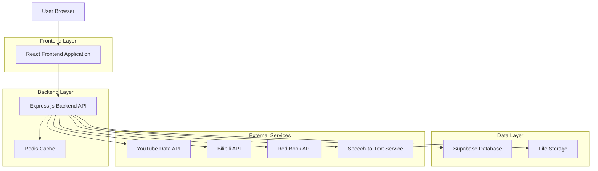
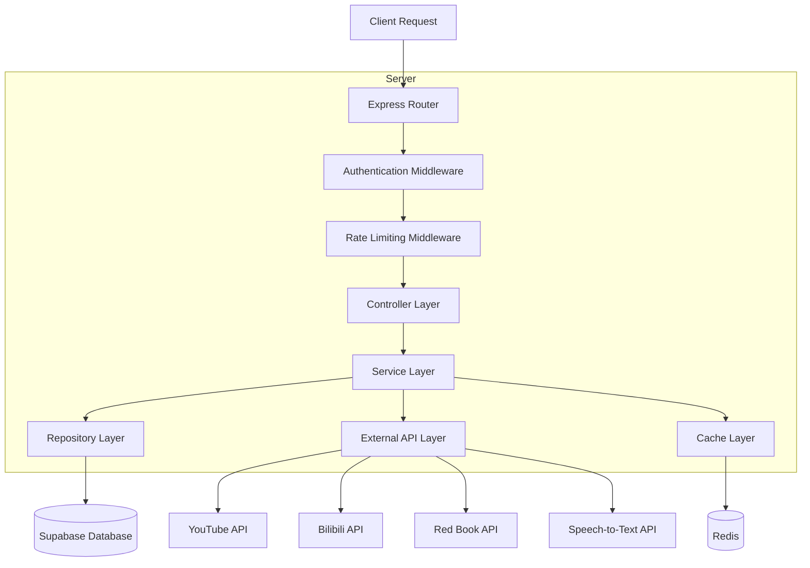
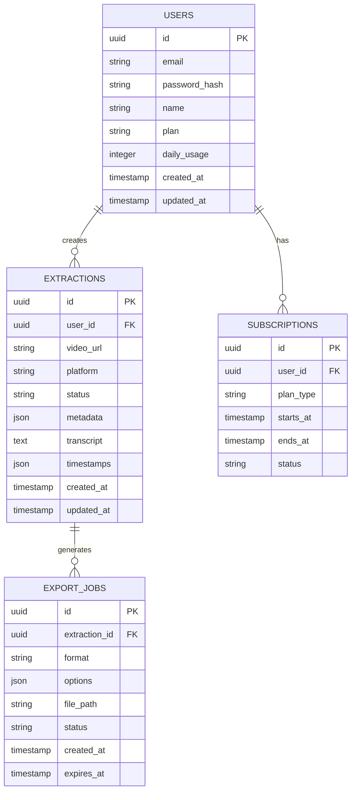

# Video Transcript Extractor - Technical Architecture Document

## 1. Architecture Design



## 2. Technology Description

* Frontend: React\@18 + TypeScript + Tailwind CSS + Vite

* Backend: Express.js\@4 + TypeScript + Node.js

* Database: Supabase (PostgreSQL)

* Cache: Redis for rate limiting and temporary data

* Storage: Supabase Storage for exported files

* Speech-to-Text: OpenAI Whisper API or Google Speech-to-Text

* Video Processing: yt-dlp for video download and metadata extraction

## 3. Route Definitions

| Route           | Purpose                                             |
| --------------- | --------------------------------------------------- |
| /               | Home page with URL input and platform selection     |
| /transcript/:id | Transcript viewer with editing and navigation tools |
| /export/:id     | Export page with format options and download        |
| /history        | User's extraction history and management            |
| /account        | User profile and subscription management            |
| /login          | User authentication page                            |
| /register       | User registration page                              |

## 4. API Definitions

### 4.1 Core API

**Video URL Processing**

```
POST /api/extract
```

Request:

| Param Name | Param Type | isRequired | Description                                   |
| ---------- | ---------- | ---------- | --------------------------------------------- |
| url        | string     | true       | Video URL from supported platforms            |
| format     | string     | false      | Preferred transcript format (default: 'text') |
| language   | string     | false      | Target language for transcription             |

Response:

| Param Name | Param Type | Description                                                        |
| ---------- | ---------- | ------------------------------------------------------------------ |
| id         | string     | Unique extraction job ID                                           |
| status     | string     | Processing status ('pending', 'processing', 'completed', 'failed') |
| progress   | number     | Processing progress percentage                                     |

Example:

```json
{
  "url": "https://www.youtube.com/watch?v=dQw4w9WgXcQ",
  "format": "srt",
  "language": "en"
}
```

**Get Extraction Status**

```
GET /api/extract/:id
```

Response:

| Param Name | Param Type | Description                            |
| ---------- | ---------- | -------------------------------------- |
| id         | string     | Extraction job ID                      |
| status     | string     | Current processing status              |
| transcript | object     | Transcript data with timestamps        |
| metadata   | object     | Video metadata (title, duration, etc.) |

**Export Transcript**

```
POST /api/export/:id
```

Request:

| Param Name | Param Type | isRequired | Description                                         |
| ---------- | ---------- | ---------- | --------------------------------------------------- |
| format     | string     | true       | Export format ('txt', 'srt', 'vtt', 'json', 'docx') |
| options    | object     | false      | Format-specific options                             |

Response:

| Param Name  | Param Type | Description                                  |
| ----------- | ---------- | -------------------------------------------- |
| downloadUrl | string     | Temporary download URL for the exported file |
| filename    | string     | Generated filename                           |
| expiresAt   | string     | URL expiration timestamp                     |

**User Authentication**

```
POST /api/auth/login
```

Request:

| Param Name | Param Type | isRequired | Description        |
| ---------- | ---------- | ---------- | ------------------ |
| email      | string     | true       | User email address |
| password   | string     | true       | User password      |

Response:

| Param Name | Param Type | Description              |
| ---------- | ---------- | ------------------------ |
| token      | string     | JWT authentication token |
| user       | object     | User profile information |

## 5. Server Architecture Diagram



## 6. Data Model

### 6.1 Data Model Definition



### 6.2 Data Definition Language

**Users Table**

```sql
CREATE TABLE users (
    id UUID PRIMARY KEY DEFAULT gen_random_uuid(),
    email VARCHAR(255) UNIQUE NOT NULL,
    password_hash VARCHAR(255) NOT NULL,
    name VARCHAR(100) NOT NULL,
    plan VARCHAR(20) DEFAULT 'free' CHECK (plan IN ('free', 'registered', 'premium')),
    daily_usage INTEGER DEFAULT 0,
    created_at TIMESTAMP WITH TIME ZONE DEFAULT NOW(),
    updated_at TIMESTAMP WITH TIME ZONE DEFAULT NOW()
);

CREATE INDEX idx_users_email ON users(email);
CREATE INDEX idx_users_plan ON users(plan);
```

**Extractions Table**

```sql
CREATE TABLE extractions (
    id UUID PRIMARY KEY DEFAULT gen_random_uuid(),
    user_id UUID REFERENCES users(id),
    video_url TEXT NOT NULL,
    platform VARCHAR(50) NOT NULL,
    status VARCHAR(20) DEFAULT 'pending' CHECK (status IN ('pending', 'processing', 'completed', 'failed')),
    metadata JSONB,
    transcript TEXT,
    timestamps JSONB,
    created_at TIMESTAMP WITH TIME ZONE DEFAULT NOW(),
    updated_at TIMESTAMP WITH TIME ZONE DEFAULT NOW()
);

CREATE INDEX idx_extractions_user_id ON extractions(user_id);
CREATE INDEX idx_extractions_status ON extractions(status);
CREATE INDEX idx_extractions_platform ON extractions(platform);
CREATE INDEX idx_extractions_created_at ON extractions(created_at DESC);
```

**Export Jobs Table**

```sql
CREATE TABLE export_jobs (
    id UUID PRIMARY KEY DEFAULT gen_random_uuid(),
    extraction_id UUID REFERENCES extractions(id),
    format VARCHAR(10) NOT NULL,
    options JSONB,
    file_path TEXT,
    status VARCHAR(20) DEFAULT 'pending',
    created_at TIMESTAMP WITH TIME ZONE DEFAULT NOW(),
    expires_at TIMESTAMP WITH TIME ZONE DEFAULT NOW() + INTERVAL '24 hours'
);

CREATE INDEX idx_export_jobs_extraction_id ON export_jobs(extraction_id);
CREATE INDEX idx_export_jobs_expires_at ON export_jobs(expires_at);
```

**Subscriptions Table**

```sql
CREATE TABLE subscriptions (
    id UUID PRIMARY KEY DEFAULT gen_random_uuid(),
    user_id UUID REFERENCES users(id),
    plan_type VARCHAR(20) NOT NULL,
    starts_at TIMESTAMP WITH TIME ZONE DEFAULT NOW(),
    ends_at TIMESTAMP WITH TIME ZONE,
    status VARCHAR(20) DEFAULT 'active' CHECK (status IN ('active', 'cancelled', 'expired'))
);

CREATE INDEX idx_subscriptions_user_id ON subscriptions(user_id);
CREATE INDEX idx_subscriptions_status ON subscriptions(status);
```

**Row Level Security Policies**

```sql
-- Enable RLS
ALTER TABLE users ENABLE ROW LEVEL SECURITY;
ALTER TABLE extractions ENABLE ROW LEVEL SECURITY;
ALTER TABLE export_jobs ENABLE ROW LEVEL SECURITY;
ALTER TABLE subscriptions ENABLE ROW LEVEL SECURITY;

-- Users can only access their own data
CREATE POLICY "Users can view own profile" ON users
    FOR SELECT USING (auth.uid() = id);

CREATE POLICY "Users can update own profile" ON users
    FOR UPDATE USING (auth.uid() = id);

-- Extractions policies
CREATE POLICY "Users can view own extractions" ON extractions
    FOR SELECT USING (auth.uid() = user_id);

CREATE POLICY "Users can create extractions" ON extractions
    FOR INSERT WITH CHECK (auth.uid() = user_id);

-- Grant permissions
GRANT SELECT ON users TO anon;
GRANT ALL PRIVILEGES ON users TO authenticated;
GRANT ALL PRIVILEGES ON extractions TO authenticated;
GRANT ALL PRIVILEGES ON export_jobs TO authenticated;
GRANT ALL PRIVILEGES ON subscriptions TO authenticated;
```

