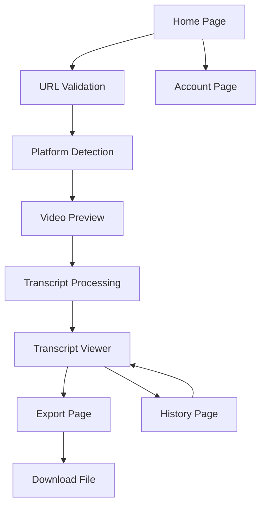

# Video Transcript Extractor - Product Requirements Document

## 1. Product Overview
A web-based tool that automatically extracts transcripts from videos on popular platforms including YouTube, Bilibili, and Red Book (Xiaohongshu). Users simply paste video URLs to get accurate transcripts with multiple export options.

The product solves the time-consuming manual transcription process for content creators, researchers, and students who need text versions of video content for analysis, translation, or accessibility purposes.

## 2. Core Features

### 2.1 User Roles
| Role | Registration Method | Core Permissions |
|------|---------------------|------------------|
| Guest User | No registration required | Can extract up to 3 transcripts per day |
| Registered User | Email registration | Can extract up to 20 transcripts per day, save history |
| Premium User | Subscription upgrade | Unlimited extractions, batch processing, priority support |

### 2.2 Feature Module
Our video transcript extractor consists of the following main pages:
1. **Home page**: URL input interface, platform selection, recent extractions preview.
2. **Transcript viewer**: Display extracted transcript, editing tools, timestamp navigation.
3. **Export page**: Format selection, download options, sharing features.
4. **History page**: Previous extractions, search and filter, re-download options.
5. **Account page**: User profile, subscription management, usage statistics.

### 2.3 Page Details
| Page Name | Module Name | Feature description |
|-----------|-------------|---------------------|
| Home page | URL Input | Validate and process video URLs from YouTube, Bilibili, Red Book |
| Home page | Platform Detection | Automatically detect video platform and show platform-specific options |
| Home page | Quick Preview | Show video thumbnail, title, duration before extraction |
| Transcript viewer | Text Display | Show extracted transcript with timestamps and speaker identification |
| Transcript viewer | Edit Tools | Allow users to correct text, merge segments, add notes |
| Transcript viewer | Navigation | Jump to specific timestamps, search within transcript |
| Export page | Format Options | Export as TXT, SRT, VTT, JSON, or Word document |
| Export page | Customization | Choose timestamp format, speaker labels, segment breaks |
| History page | Extraction List | Display all previous extractions with metadata |
| History page | Search & Filter | Find extractions by date, platform, or keywords |
| Account page | Profile Management | Update user information, change password |
| Account page | Subscription | Manage premium features and billing |

## 3. Core Process
**Guest/Registered User Flow:**
1. User visits home page and pastes video URL
2. System validates URL and detects platform
3. User confirms extraction and waits for processing
4. System displays transcript in viewer with editing options
5. User can export transcript in preferred format
6. Registered users can save to history for future access

**Premium User Flow:**
1. Same as above, plus batch URL processing
2. Access to advanced editing features
3. Priority processing queue
4. Extended history retention

## 4. User Interface Design
### 4.1 Design Style
- **Primary colors**: Deep blue (#2563eb) for trust and professionalism, light gray (#f8fafc) for backgrounds
- **Secondary colors**: Green (#10b981) for success states, orange (#f59e0b) for warnings
- **Button style**: Rounded corners (8px radius) with subtle shadows and hover effects
- **Font**: Inter for headings (16-24px), system fonts for body text (14-16px)
- **Layout style**: Clean card-based design with generous whitespace, sticky navigation header
- **Icons**: Outline style icons from Heroicons, platform logos for video sources

### 4.2 Page Design Overview
| Page Name | Module Name | UI Elements |
|-----------|-------------|-------------|
| Home page | URL Input | Large centered input field with paste button, platform icons, drag-and-drop zone |
| Home page | Video Preview | Thumbnail card with title, duration, channel info, extract button |
| Transcript viewer | Text Display | Scrollable text area with line numbers, highlight on hover, copy buttons |
| Transcript viewer | Timeline | Horizontal progress bar with clickable timestamps, play/pause controls |
| Export page | Format Selection | Radio buttons with format previews, customization toggles |
| History page | List View | Table with sortable columns, search bar, filter dropdowns |

### 4.3 Responsiveness
Desktop-first design with mobile-adaptive layout. Touch-optimized controls for mobile users, collapsible sidebar navigation, and swipe gestures for transcript navigation.